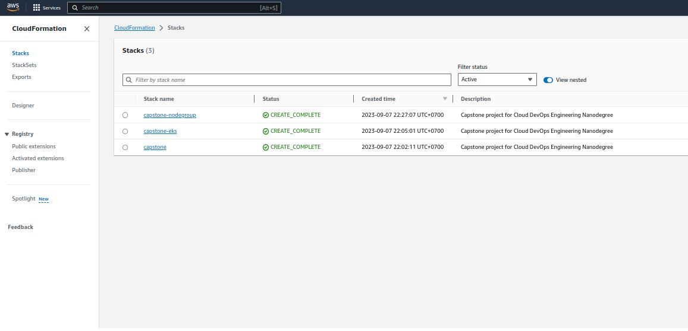

[Github link](https://github.com/tungthanh97/udacity-cloud-devops-capstone)

## Authors

- [@tungthanh97](https://www.github.com/tungthanh97)


### CircleCI Status

[](https://github.com/tungthanh97/udacity-cloud-devops-capstone)

# Project Overview

In this project you will apply the skills and knowledge which were developed throughout the Cloud DevOps Nanodegree program. These include:

- Using Circle CI to implement Continuous Integration and Continuous Deployment
- Building pipelines
- Working with CloudFormation to deploy clusters/infrastructure
- Building Docker containers in pipelines
- Building Kubernetes clusters
- Working in AWS

# Application

The Application is based on a python3 script using flask to render a simple webpage in the user's browser. A requirements.txt is used to ensure that all needed dependencies come along with the Application.

## CircleCi - CI/CD Pipelines
 I developed a CI/CD pineline includes:

 

 ### CI- Linting with Hadolint
 #### Lint step fails:


 #### Lint step pass:

 

## Kubernetes Cluster

I used AWS CloudFormation to deploy the Kubernetes Cluster.
The CloudFormation Deployment can be broken down into four Parts:
- **Networking**, to ensure new nodes can communicate with the Cluster
- **Elastic Kubernetes Service (EKS)** is used to create a Kubernetes Cluster
- **NodeGroup**, each NodeGroup has a set of rules to define how instances are operated and created for the EKS-Cluster

### CloudFormation Stacks:


### Instances Running in Cluster Nodes



### Some kubectl commands to check k8s resources

```bash
    # Fet k8s configs
    aws eks --region us-east-1 update-kubeconfig --name CapstoneEKS-cEYGixysybXa
    # Switch context
    kubectl config use-context arn:aws:eks:us-east-1:815741563896:cluster/CapstoneEKS-cEYGixysybXa
    # Manually apply k8s resource
    kubectl apply -f aws-authen-cm.yml
    # See ndoes in cluster
    kubectl get nodes
    # See running pods
    kubectl get pods
    # See services
    kubectl get services
```


## Access the Application

Public LB DNS: http://a3ef06bcb9ddb492ea6301c919658392-1426367101.us-east-1.elb.amazonaws.com/


